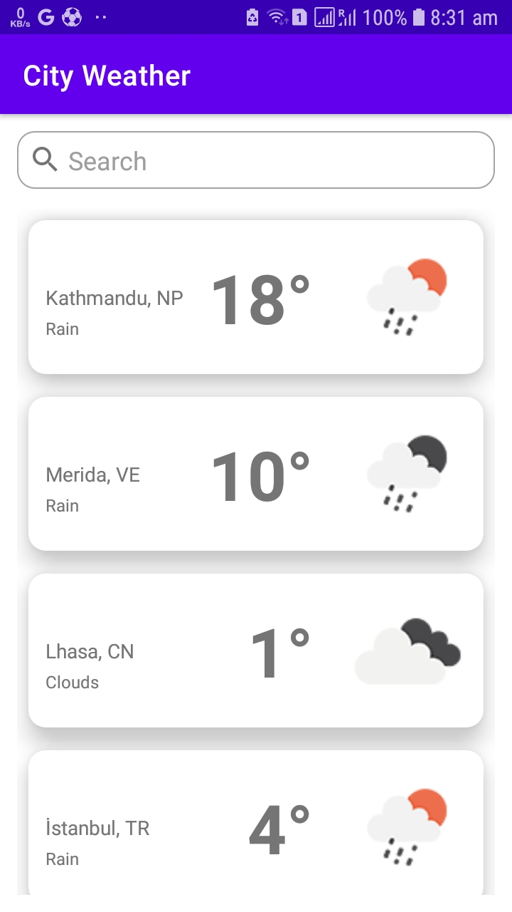
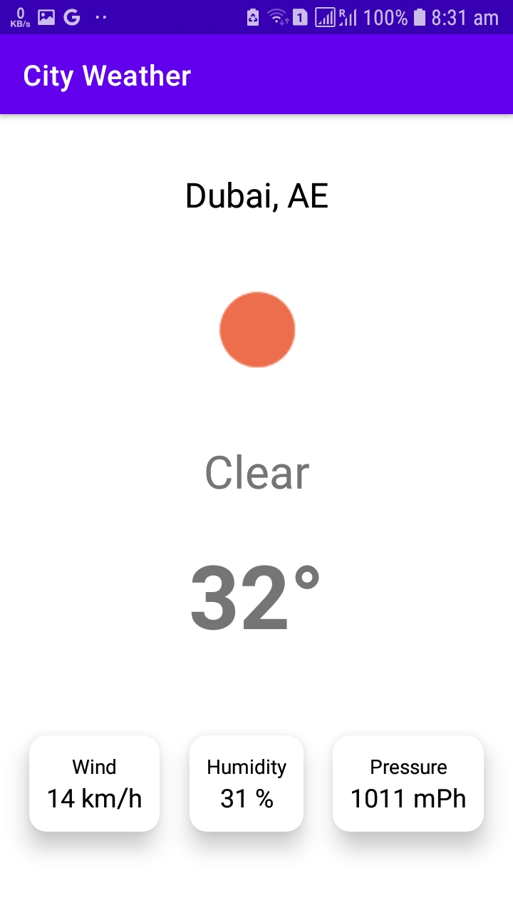

# City Weather Application
A simple MVVM application to show a list of cities weather where you can search for your favorite city weather and see its weather info

Weather information includes
- Current temperature.
- Weather condition.
- Wind speed, humidity percentage, and pressure.
- Search for other cities' weathers.

Technologies used in project:
- Kotlin Coroutines for background operations.
- MVVM architecture.
- ViewModel and LiveData.
- Hilt for dependency  injection.
- Navigation component.
- A data layer with a repository.
- A collection of unit rest.
- Utility classes for unit conversions and JSON parsing.

Third-party libraries used in this project:
- [Glide](https://github.com/bumptech/glide): To load and show images.
- [Truth](https://truth.dev/): Is library for performing assertions in tests.
- [Gson](https://github.com/google/gson): To convert JSON to Java objects.

The project consists of:
- data: To act as the data layer.
- ui: Contains the app pages.
  - List: Show the list of the cities and a search bar to search for city by city name.
  - Details: Show the selected city weather details
- utils: For utilities.

# How to use the app
- When open the app a list of cicties with a summary for each city weather will appear in a list.

- When search, use the city name and click "search" button on youe keyboard.

- If a city is selected a details page will open

# Known issues
- There are a delay when loading the list and that's becuase parsing the JSON everytime the list page is opened, and that can be solved through cashing the parsed data in the local database, and using ViewModel.

# Future work
- Fix known issues.
- Add UI states
- Add pagination for the cities list.
- Add more test.
- Store the parsed JSON in ROOM database.
- Download the the data folder from the API and extract the JSON.
- Support dark mode.
