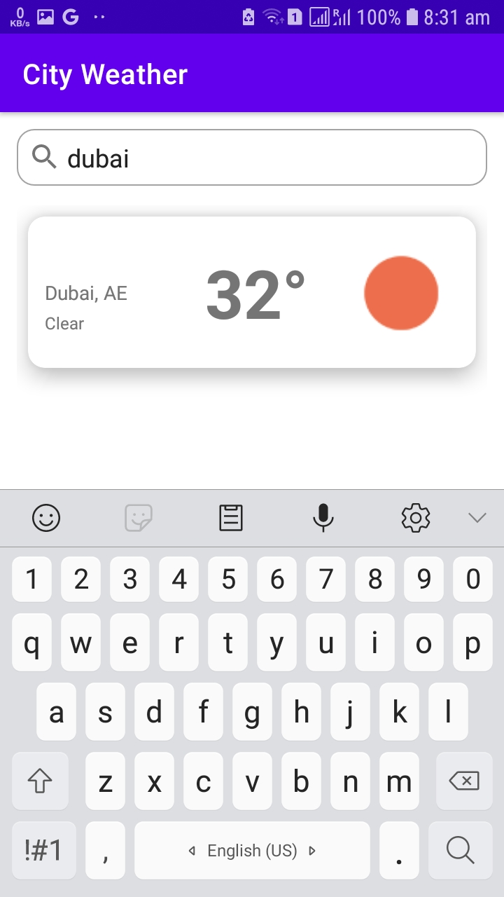

# City Weather Application

A simple MVVM application to show a list of cities weather where you can search for your favorite
city weather and see its weather info

Weather information includes

- Current temperature.
- Weather condition.
- Wind speed, humidity percentage, and pressure.
- Search for other cities' weathers.

Technologies used in project:

- Kotlin Coroutines for background operations.
- MVVM architecture.
- ViewModel and LiveData.
- Hilt for dependency injection.
- Navigation component.
- A data layer with a repository.
- A collection of unit rest.
- Utility classes for unit conversions and JSON parsing ..etc.

Third-party libraries used in this project:

- [Glide](https://github.com/bumptech/glide): To load and show images.
- [Truth](https://truth.dev/): Is library for performing assertions in tests.
- [Gson](https://github.com/google/gson): To convert JSON to Java objects.

The project consists of:

- data: To act as the data layer.
- ui: Contains the app pages.
    - List: Show the list of the cities and a search bar to search for city by city name.
    - Details: Show the selected city weather details
- utils: For utilities.

# How to use the app

- When open the app a list of cities with a summary for each city weather will appear in a list.

- When search, use the city name and click "search" button on you keyboard.

- If a city is selected a details page will open

# Known issues

- There are a delay when loading the list when you open the app the first time because the file is being downloaded from the server, parsed the json, save it in database, then finally will be shown in the screen.
 - Next time you will open the application the data will be loaded directly from the database, but still expecting to take some time due the size of the data (All data retrieved at once).
 - This can be solved by applying pagination, by getting the data page by page with a certain size (ex: 10 items per request), that will make retrieving the data much faster and efficient.

# Future work

- Fix known issues.
- Add pagination for the cities list.
- Add more test.
